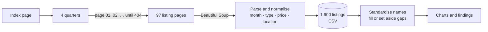
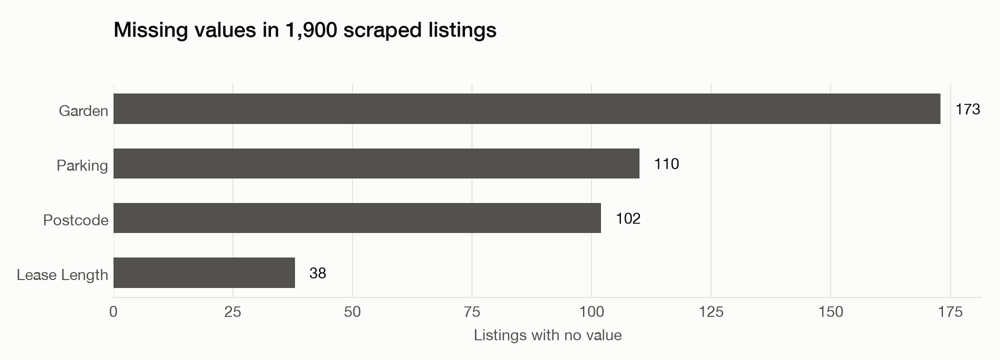
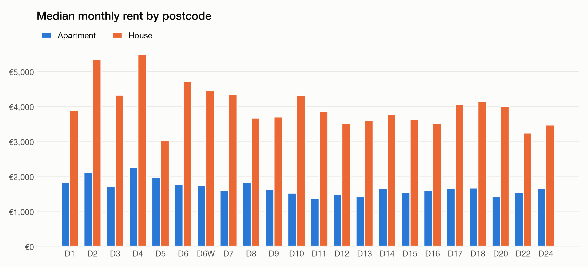
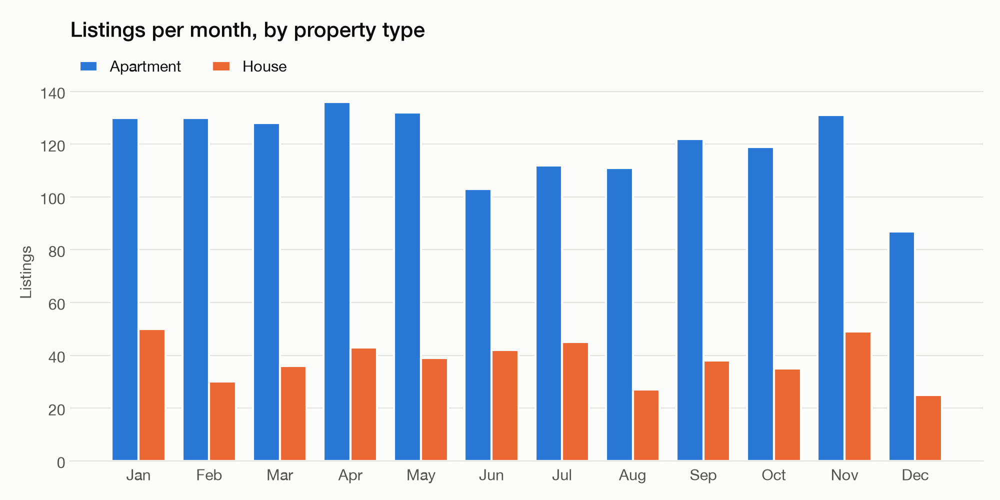
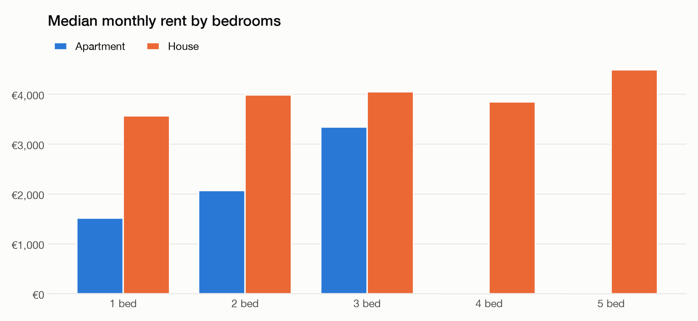

<p align="center">
  
</p>

<h1 align="center">Dublin Rental Market Analysis</h1>

<p align="center">
  <strong>Scrape a year of Dublin rental listings, clean them carefully, and read what drives the rent.</strong>
</p>

<p align="center">
  <a href="https://jjmensah.github.io/enam_portfolio/projects/dublin-rental-market/"></a>
  
  
  
  
</p>

---

> **Try it:** an interactive site in [`web/`](web/) turns the analysis into a budget-driven door map of Dublin, a rent estimator, a replay of the scraper and a cleaning lab.

A two-notebook project that collects **1,900 rental listings** from the Dublin Rental Property
Database, repairs the gaps and inconsistencies in them, and charts how property type, postcode,
bedrooms and season relate to monthly rent.

## Highlights

- **A scraper with no hard-coded page counts.** It follows the `Q{quarter}-page{nn}` URL pattern
  and treats a 404 as the end of a quarter — 97 pages across four quarters.
- **Parsing that cleans as it goes.** Month and type are split out of one header, prices lose
  their "per month" text, and three hyphen styles collapse into one before location and postcode
  are separated.
- **Missing values filled with evidence, not defaults.** Gardens follow property type, lease
  lengths take the shared median and mode, parking is predicted with logistic regression, and
  listings without a postcode are set aside rather than invented.
- **Clear findings.** A house typically rents for more than twice an apartment in the same
  postcode, and Dublin 2, 4 and 6 lead the market.

## Pipeline



## Filling the gaps

| Column | Missing | Resolution |
| --- | ---: | --- |
| Garden | 173 | Apartments → `No` (no apartment in the data has one); remaining houses → `Yes` (91% of houses do) |
| Parking | 110 | Predicted by logistic regression on location, type, bedrooms, bathrooms and price |
| Postcode | 102 | All are County Dublin listings, which have no postcode — kept aside, excluded from postcode charts |
| Lease length | 38 | 12 months, the median and mode for every contact and property type |

<p align="center"></p>

## Findings

<p align="center"></p>

Apartments sit between roughly €1,400 and €2,300 a month across postcodes; houses between €3,000
and €5,500. Central Dublin 2, 4 and 6 carry the highest rents.

<p align="center"></p>

Apartments dominate supply every month. Listings peak in April and fall away in December.

<p align="center"></p>

## Repository layout

```text
.
├── assets/
│   ├── cover.svg
│   └── figures/                       # generated by scripts/make_figures.py
├── data/
│   └── dublin_rental_listings.csv     # output of notebook 01
├── notebooks/
│   ├── 01_collect_rental_data.ipynb   # scraping and parsing
│   └── 02_explore_rental_market.ipynb # cleaning, imputation and charts
├── reference/
│   └── brief.pdf                      # original module brief
├── scripts/
│   └── make_figures.py
├── web/                               # interactive site (React + Vite)
└── requirements.txt
```

## Running it

```bash
python -m venv .venv && source .venv/bin/activate
pip install -r requirements.txt
jupyter notebook notebooks/02_explore_rental_market.ipynb
```

The scraped CSV is committed, so notebook 02 runs on its own. The source site for notebook 01
(`mlg.ucd.ie/modules/python/sources/rental/`) is no longer online. To regenerate the figures:

```bash
python scripts/make_figures.py
```

## Data

Listings come from the Dublin Rental Property Database used in UCD's COMP47670 module. Fields:
month, property type, monthly price, location, Dublin postcode, bedrooms, bathrooms, parking,
garden, lease length and contact type.
